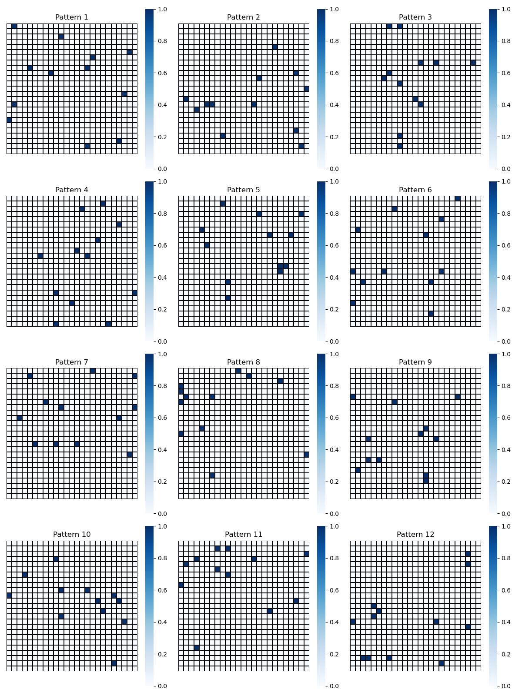
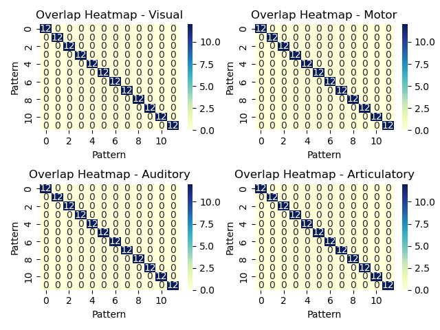
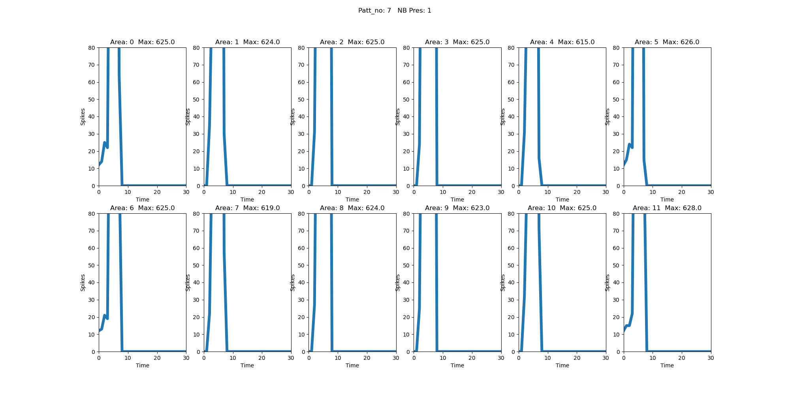
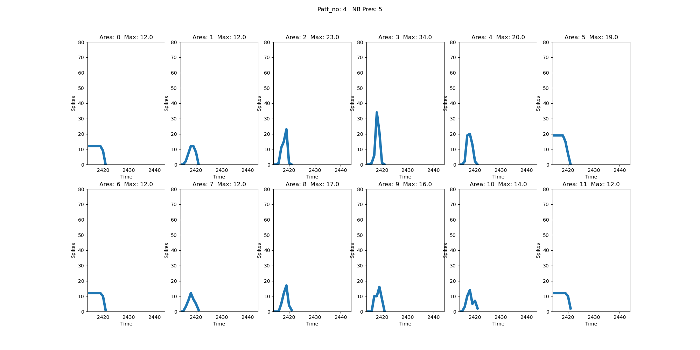

# 02 Running the default simulation

The default setting CogniNest ships with is object and action word learning (see [Tomasello et al., 2017](https://doi.org/10.1016/j.neuropsychologia.2016.07.004), [2018](https://doi.org/10.3389/fncom.2018.00088); [Carrière et al., 2023]( https://doi.org/10.1080/0954898X.2024.2421196)). We will use it as an example of how to run a simulation in general, how to interpret model diagnostics during training and how to access model output.

## Running the simulation

Starting the docker container, you will be in the directory ```/app/cogninest```. From there, you can start a model training routine with ```python training_testing/main/main_training.py```.

This command will start a verbose model simulation with the following expected output:

```
              -- N E S T --
  Copyright (C) 2004 The NEST Initiative

 Version: 3.6.0
 Built: Jul 15 2024 22:12:52

 This program is provided AS IS and comes with
 NO WARRANTY. See the file LICENSE for details.

 Problems or suggestions?
   Visit https://www.nest-simulator.org

 Type 'nest.help()' to find out more about NEST.


Jun 11 10:21:25 Install [Info]:
    loaded module Felix Module

Initializing FelixNet
Adding noise to external area: V1
Adding noise to external area: M1_L
Adding noise to external area: A1
Adding noise to external area: M1_i

🔗 **Creating Inter-Area Connections...**

🌐 **Cross-System Connections:**
Connecting Cross-System Areas: 100%|███████████████████████████████████████████████████| 20/20 [00:00<00:00, 179.79it/s]

🏠 **Within-System Connections:**
Connecting Within-System Areas: 100%|██████████████████████████████████████████████████| 24/24 [00:00<00:00, 155.76it/s]

✅ Directory './plot_training' already exists. No files deleted.
Build Time: 1.0 s
✅ Step 3: Calling `show_owerlapp_pattern()`
#################
CHECKING OVERLAPP
#################
✅ Directory './plot_training' already exists. No files deleted.
✅ Step 4: Calling 'plot_pattern_presence()'
✅ Pattern presence subplot saved: ./plot_training/motor_patterns.png
✅ Pattern presence subplot saved: ./plot_training/visu_patterns.png
✅ Pattern presence subplot saved: ./plot_training/audi_patterns.png
✅ Pattern presence subplot saved: ./plot_training/arti_patterns.png
📁 Created directory './save_network'.
📁 Created directory './processing_data'.
```

After this initiatization process, training begins. The command line will continuosly provide output about which training pattern is being presented, e.g.:

```
################
Presentation patt_no: 3
################
Presentation patt_no: 11
################
Presentation patt_no: 4
################
Presentation patt_no: 2
################
Presentation patt_no: 7
################
Presentation patt_no: 1
################
Presentation patt_no: 7
```

This output gives insight into the structure of a CogniNest simulation:

1) Import NEST

2) Import felixmodule

3) Initialize all network areas (individual neurons, within-area synaptic connections, between-area connections, noise generators to primary sensorimotor areas)

4) Initialize diagnostic output directories (plot_training, save_network, processing_data)

5) Initialize neural stimulation patterns for training and visualize them

6) Begin training

## Model diagnostics

At this point, you are already able to check basic model diagnostics. During training, the following diagnostics are collected and reported:

### Visualized training patterns and their respective between-pattern overlap

Depending on the research question, the training patterns should either be orthogonal to each other (i.e. share no stimulated neurons) or have a specific overlap structure (i.e. all patterns share two specific neurons, see [Henningsen-Schomers et al., 2022](https://doi.org/10.1007/s00426-021-01591-6) and [Dobler et al., 2024](https://doi.org/10.1111/lang.12646) for detailed overlap-based research questions and implementation).

For the object-action paradigm, there should be no between-pattern overlap. Before you run a long training session, it is best practice to ensure that there is indeed no overlap in the randomly generated model patterns.

Open ```plot_training/visu_patterns.png```. The figure should look similar to this, with every dark square corresponding to a stimulated neuron on a 25x25 grid.



Visually inspect all other grounding patterns (motor, articulatory and auditory).

For an overview of between-pattern overlap, open ```plot_training/pattern_overlapp_matrix.png```. The figure should look similar to this, with the number of overlapping neurons plotted on a pattern-by-pattern matrix for each primary sensory and motor area. There should only be overlap on the identity diagonal in all four plots.



### Model activity during training

While training patterns should only be checked once - at the beginning of training - this diagnostic should be consulted throughout training, to spot unexpected model behaviour (e.g., unregulated, exploding activity during training, indicating a merging of cell assemblies) and interrupt training if necessary.

By default, running the simulation will create a plot of the number of excitatory spikes per timesteps for each model area every 5 pattern presentations. The interval for plotting can be changed in ```config/config_training.py```.

Open ```plot_training/plot_activation_0.png```. The figure - in the beginning of training - should look similar to this:



The title of the figure specifies which pattern is currently being presented, and how often it has been presented for. During early training trials (i.e. a low number of presentations), the above figure is characteristic of network activity: responses in the stimulated primary areas of the model (areas 0, 5, 6 and 11) consist of the stimulated neurons, but deeper layers of the model (e.g. 1, 2, 7, 8) respond with a sharp and short-lived burst of >= 80 simulatenously active neurons. This early behaviour is due to the network being under-tuned at initialization: the randomly initialized synaptic connections are not yet specific enough to curtail this burst of activity.

Only a few presentations later, the characteristic activity curves look like this:



Spiking activity remains short-lived, but by now the learning rule has pruned surplus synaptic connections that were irrelevant to the training patterns. Now, activity no longer bursts out of control, and instead exhibits a steady increase the deeper the network area lies in the processing stream. 'Central' model areas (e.g., 2, 3, 8 and 9) are densely connected, and thus exhibit the highest number of spikes.

### Model activity during training (raw)

The activity figures are plotted from raw data files in ```processing_data```. If you wish to work with the raw model output, we recommend using the function ```dat_from_file(string_pattern)``` in ```utils.gathering```. It converts the NEST output into a dataframe annotating the spiking neurons by model area.


### Model state during training

The model state is saved at specific training trials (i.e. when all patterns have been presented N times). These are specified in ```config/config_training.py```. The model state is defined in ```network.store``` as the following dictionary:

```
network = {
        "param_excitatory": list_param_value,
        "param_inhibitory": list_param_value_inh,
        "param_global": list_param_value_glob,
        "weight": weights,
        "pattern_motor": motor,
        "pattern_visual": visu,
        "pattern_auditory": audi,
        "pattern_articulatory": arti,
        "excitatory_neurons": excitatory_neurons,
        "inhibitory_neurons": inhibitory_neurons,
        "global_inhibition": global_inhibition,
    }
```

The full network state thus consists of all neuron parameters, all synaptic weights, the initialized training patterns, and all simulated neurons. It is saved as a ```pickle``` file in ```save_network```.

Continue running training until the first network state is saved. By default, that is after 10 training trials.

## Testing the model

It is best practice to run training and testing as separate programs. This guarantees that the testing routine does not affect the learning outcome of the model. For testing, a saved model state (as described above) will be loaded.

To begin testing, run ```python training_testing/main/main_testing.py```. The expected output looks as follows:

```
              -- N E S T --
  Copyright (C) 2004 The NEST Initiative

 Version: 3.6.0
 Built: Jul 15 2024 22:12:52

 This program is provided AS IS and comes with
 NO WARRANTY. See the file LICENSE for details.

 Problems or suggestions?
   Visit https://www.nest-simulator.org

 Type 'nest.help()' to find out more about NEST.


Jun 11 13:47:44 Install [Info]:
    loaded module Felix Module
Python interpreter: /usr/bin/python
🚀 Starting FelixNet Testing...
🚀 Starting FelixNet Testing...
🧪 Testing Network: save_network
✅ Directory './testing_data/testing_save_network' already exists. No files deleted.
🎵🗣️ Running both auditory and articulatory tests for save_network
network_out:  ./testing_data/testing_save_network
✅ Directory './testing_data/testing_save_network' already exists. No files deleted.
##############################
     NETWORK: 10
##############################
save_network/network_10
Initializing FelixNet
['V1' 'TO' 'AT' 'PF_L' 'PM_L' 'M1_L' 'A1' 'AB' 'PB' 'PF_i' 'PM_i' 'M1_i']
Adding pg noise to:  V1
Adding pg noise to:  M1_L
Adding pg noise to:  A1
Adding pg noise to:  M1_i
✅ Directory './testing_data' already exists. No files deleted.
```

After loading the network at training trial 10, testing will begin. At the end of each test stimulation, a few verbose diagnostics will be printed to the console:

```
TESTING
      STIM:   0
patt_no: 0
gi_AB: 0.09858476783301198
gi_PM_i: 0.07913991616811732
gi_AB: 0.41978889525143726
gi_PM_i: 0.0984324424996777
```

### Visualizations

Visualizations of testing outcomes - rudimentary results like cell assembly size by area - can be accessed in ```./graphs```.

### Raw test data

Raw, unprocessed test data can be found in ```./testing_data```.